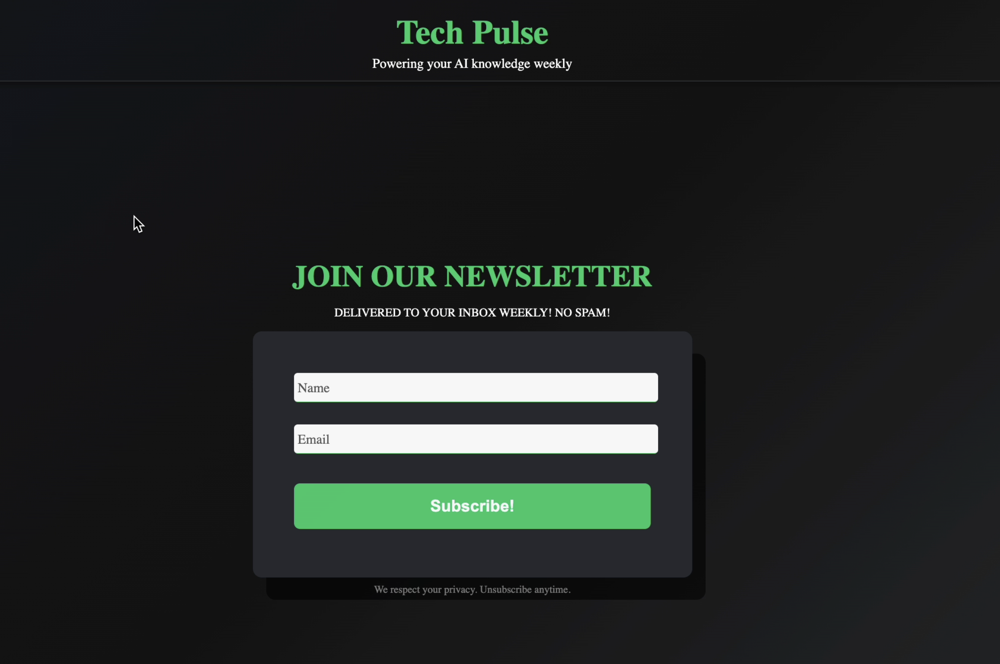

# Floating Label Form (HTML/CSS) 💬

Frontend Project Challenge 1

This challenge helped me practice CSS gradients, transitions, and layout styling — and it’s already sharpening my front-end instincts.

**My Linkedin Post:** [View Demo of Animated Features](https://www.linkedin.com/posts/lindseyharr_frontenddevelopment-womenintech-html-activity-7396972201821880321-5QX9?utm_source=share&utm_medium=member_desktop&rcm=ACoAAEqPatABp7YhGK-SwGQawFx9-NJqNPsTRhc)

## Features ✨

- A smooth linear-gradient background that transitions from navy blue to black
- Clean floating label animations that enhance form interaction
- Glowing input fields for subtle, modern visual feedback

