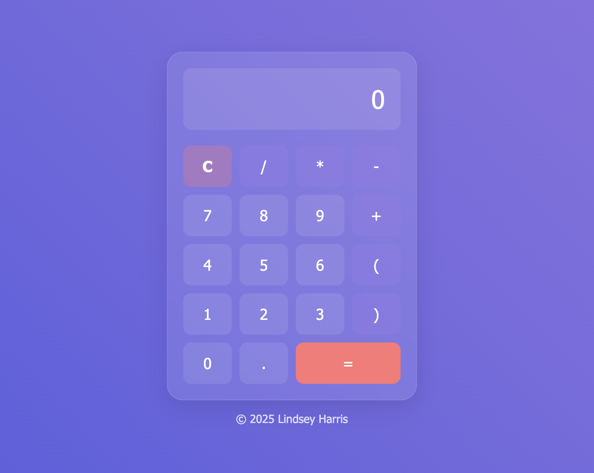

# Glassmorphism Calculator (HTML/CSS/JS) 📱

Frontend Project Challenge 4

A modern calculator built using HTML, CSS, and JavaScript, featuring a glassmorphism UI design. This project focuses on clean layout, interactive functionality, while reinforcing core JavaScript logic and DOM manipulation.

🔗 Live Demo: [View Live Demo]()

## Features ✨

- Glassmorphism UI (blurred background + transparency)

- Basic arithmetic operations:
  - Addition
  - Subtraction
  - Multiplication
  - Division

- Clear (`C`) and delete functionality

- Multiplication symbol normalization (`x` → `*`) for evaluation

- Error handling for invalid expressions (displays `Error` and auto-clears)

- Smooth hover and click effects

